# Marketing Site CI/CD & Deployment Strategy

## Overview

This document outlines the complete CI/CD pipeline for the CareerLead AI Marketing Site, including deployment strategy, environment management, and safety mechanisms.

---

## Current Architecture

### Project Structure

```
CareerLead AI (Firebase Project: careercompass-ai-6ci2q)
├── Main App (/)
│   ├── Hosting: Firebase App Hosting
│   ├── URL: app.careerlead.ai
│   └── Auto-deploys: From main branch
│
└── Marketing Site (/)
    ├── Hosting: Firebase Hosting (to be configured)
    ├── URL: careerlead.ai (www.careerlead.ai)
    └── Manual deployment (CURRENT - needs automation!)
```

### Problem Statement

- ❌ No automated deployment pipeline
- ❌ No preview deployments for PRs
- ❌ No staging environment
- ❌ Manual deployments are risky and error-prone
- ❌ No rollback mechanism
- ❌ Cannot test changes before production

---

## Proposed Solution

### Three-Environment Strategy

```
┌─────────────────────────────────────────────────────────┐
│                    ENVIRONMENTS                          │
├─────────────────────────────────────────────────────────┤
│                                                           │
│  1. PREVIEW (Per-PR)                                     │
│     └─ URL: marketing-site-pr-123--project.web.app      │
│     └─ Trigger: Every PR commit                         │
│     └─ Purpose: Review changes before merge             │
│                                                           │
│  2. STAGING (Pre-Production)                            │
│     └─ URL: marketing-staging.careerlead.ai             │
│     └─ Trigger: Merge to `develop` branch               │
│     └─ Purpose: Final QA before production              │
│                                                           │
│  3. PRODUCTION (Live Site)                              │
│     └─ URL: careerlead.ai, www.careerlead.ai           │
│     └─ Trigger: Merge to `main` branch                  │
│     └─ Purpose: Public-facing marketing site            │
│                                                           │
└─────────────────────────────────────────────────────────┘
```

---

## Implementation Plan

### Phase 1: Firebase Hosting Setup

#### Step 1: Update Firebase Configuration

**File:** `firebase.json` (root)

```json
{
  "apphosting": {
    "source": ".",
    "appId": "careercompass-ai-6ci2q"
  },
  "hosting": {
    "public": "marketing-site/out",
    "ignore": ["firebase.json", "**/.*", "**/node_modules/**"],
    "rewrites": [
      {
        "source": "**",
        "destination": "/index.html"
      }
    ],
    "headers": [
      {
        "source": "**/*.@(jpg|jpeg|gif|png|svg|webp|ico)",
        "headers": [
          {
            "key": "Cache-Control",
            "value": "public, max-age=31536000, immutable"
          }
        ]
      },
      {
        "source": "**/*.@(js|css)",
        "headers": [
          {
            "key": "Cache-Control",
            "value": "public, max-age=31536000, immutable"
          }
        ]
      },
      {
        "source": "**/*.@(json|xml|txt)",
        "headers": [
          {
            "key": "Cache-Control",
            "value": "public, max-age=0, must-revalidate"
          }
        ]
      }
    ],
    "cleanUrls": true,
    "trailingSlash": false
  }
}
```

#### Step 2: Add Marketing Site Build Script

**File:** `marketing-site/package.json`

```json
{
  "scripts": {
    "dev": "next dev -p 3001",
    "build": "next build",
    "export": "next build && next export",
    "start": "next start",
    "lint": "next lint",
    "deploy:preview": "npm run export && firebase hosting:channel:deploy preview",
    "deploy:staging": "npm run export && firebase hosting:channel:deploy staging",
    "deploy:production": "npm run export && firebase deploy --only hosting"
  }
}
```

#### Step 3: Create Firebase Hosting Channels

```bash
# Create staging channel
firebase hosting:channel:create staging --project careercompass-ai-6ci2q

# This creates a permanent channel for staging
# URL: https://careercompass-ai-6ci2q--staging-<hash>.web.app
```

### Phase 2: GitHub Actions Workflow

#### Create Workflow File

**File:** `.github/workflows/marketing-site.yml`

```yaml
name: Marketing Site CI/CD

on:
  push:
    paths:
      - 'marketing-site/**'
      - '.github/workflows/marketing-site.yml'
    branches:
      - main
      - develop
  pull_request:
    paths:
      - 'marketing-site/**'
    branches:
      - main
      - develop

# Cancel in-progress runs for the same branch
concurrency:
  group: ${{ github.workflow }}-${{ github.ref }}
  cancel-in-progress: true

env:
  NODE_VERSION: '18'
  WORKING_DIRECTORY: 'marketing-site'

jobs:
  # ===========================================
  # Quality Checks (Lint, Type Check, Build)
  # ===========================================
  quality:
    name: Quality Checks
    runs-on: ubuntu-latest

    steps:
      - name: Checkout code
        uses: actions/checkout@v4

      - name: Setup Node.js
        uses: actions/setup-node@v4
        with:
          node-version: ${{ env.NODE_VERSION }}
          cache: 'npm'
          cache-dependency-path: ${{ env.WORKING_DIRECTORY }}/package-lock.json

      - name: Install dependencies
        working-directory: ${{ env.WORKING_DIRECTORY }}
        run: npm ci

      - name: Run ESLint
        working-directory: ${{ env.WORKING_DIRECTORY }}
        run: npm run lint

      - name: Run TypeScript type check
        working-directory: ${{ env.WORKING_DIRECTORY }}
        run: npx tsc --noEmit

      - name: Build marketing site
        working-directory: ${{ env.WORKING_DIRECTORY }}
        run: npm run build

      - name: Export static site
        working-directory: ${{ env.WORKING_DIRECTORY }}
        run: npm run export

      - name: Upload build artifacts
        uses: actions/upload-artifact@v4
        with:
          name: marketing-site-build
          path: ${{ env.WORKING_DIRECTORY }}/out
          retention-days: 7

  # ===========================================
  # Preview Deployment (PR only)
  # ===========================================
  deploy-preview:
    name: Deploy Preview
    runs-on: ubuntu-latest
    needs: quality
    if: github.event_name == 'pull_request'

    steps:
      - name: Checkout code
        uses: actions/checkout@v4

      - name: Download build artifacts
        uses: actions/download-artifact@v4
        with:
          name: marketing-site-build
          path: ${{ env.WORKING_DIRECTORY }}/out

      - name: Deploy to Firebase Hosting Preview Channel
        uses: FirebaseExtended/action-hosting-deploy@v0
        with:
          repoToken: ${{ secrets.GITHUB_TOKEN }}
          firebaseServiceAccount: ${{ secrets.FIREBASE_SERVICE_ACCOUNT_CAREERCOMPASS_AI }}
          projectId: careercompass-ai-6ci2q
          channelId: pr-${{ github.event.pull_request.number }}
          expires: 7d
          entryPoint: ${{ env.WORKING_DIRECTORY }}
        env:
          FIREBASE_CLI_EXPERIMENTS: webframeworks

      - name: Comment PR with preview URL
        uses: actions/github-script@v7
        with:
          script: |
            const prNumber = context.payload.pull_request.number;
            const previewUrl = `https://careercompass-ai-6ci2q--pr-${prNumber}-<hash>.web.app`;

            github.rest.issues.createComment({
              issue_number: prNumber,
              owner: context.repo.owner,
              repo: context.repo.repo,
              body: `
              ## 🚀 Preview Deployment Ready!

              Your marketing site changes are deployed and ready for review:

              **Preview URL:** [Click here to preview](${previewUrl})

              ℹ️ This preview will expire in 7 days.

              ✅ Quality checks passed
              - Linting: Passed
              - Type checking: Passed
              - Build: Successful
              `
            });

  # ===========================================
  # Staging Deployment (develop branch)
  # ===========================================
  deploy-staging:
    name: Deploy to Staging
    runs-on: ubuntu-latest
    needs: quality
    if: github.ref == 'refs/heads/develop' && github.event_name == 'push'

    steps:
      - name: Checkout code
        uses: actions/checkout@v4

      - name: Download build artifacts
        uses: actions/download-artifact@v4
        with:
          name: marketing-site-build
          path: ${{ env.WORKING_DIRECTORY }}/out

      - name: Deploy to Staging Channel
        uses: FirebaseExtended/action-hosting-deploy@v0
        with:
          repoToken: ${{ secrets.GITHUB_TOKEN }}
          firebaseServiceAccount: ${{ secrets.FIREBASE_SERVICE_ACCOUNT_CAREERCOMPASS_AI }}
          projectId: careercompass-ai-6ci2q
          channelId: staging
          entryPoint: ${{ env.WORKING_DIRECTORY }}
        env:
          FIREBASE_CLI_EXPERIMENTS: webframeworks

      - name: Notify staging deployment
        run: |
          echo "================================================"
          echo "✅ Staging deployment successful!"
          echo "================================================"
          echo ""
          echo "Staging URL: https://careercompass-ai-6ci2q--staging-<hash>.web.app"
          echo "Commit: ${{ github.sha }}"
          echo "Author: ${{ github.actor }}"
          echo ""
          echo "Next step: Test on staging, then merge to main for production"

  # ===========================================
  # Production Deployment (main branch)
  # ===========================================
  deploy-production:
    name: Deploy to Production
    runs-on: ubuntu-latest
    needs: quality
    if: github.ref == 'refs/heads/main' && github.event_name == 'push'
    environment:
      name: production
      url: https://careerlead.ai

    steps:
      - name: Checkout code
        uses: actions/checkout@v4

      - name: Download build artifacts
        uses: actions/download-artifact@v4
        with:
          name: marketing-site-build
          path: ${{ env.WORKING_DIRECTORY }}/out

      - name: Deploy to Production
        uses: FirebaseExtended/action-hosting-deploy@v0
        with:
          repoToken: ${{ secrets.GITHUB_TOKEN }}
          firebaseServiceAccount: ${{ secrets.FIREBASE_SERVICE_ACCOUNT_CAREERCOMPASS_AI }}
          projectId: careercompass-ai-6ci2q
          channelId: live
          entryPoint: ${{ env.WORKING_DIRECTORY }}
        env:
          FIREBASE_CLI_EXPERIMENTS: webframeworks

      - name: Create deployment tag
        run: |
          git config user.name "GitHub Actions"
          git config user.email "actions@github.com"
          TAG_NAME="marketing-v$(date +'%Y%m%d-%H%M%S')"
          git tag -a $TAG_NAME -m "Marketing site deployment"
          git push origin $TAG_NAME

      - name: Notify production deployment
        run: |
          echo "================================================"
          echo "🎉 PRODUCTION DEPLOYMENT SUCCESSFUL!"
          echo "================================================"
          echo ""
          echo "Live URL: https://careerlead.ai"
          echo "Commit: ${{ github.sha }}"
          echo "Deployed by: ${{ github.actor }}"
          echo "Message: ${{ github.event.head_commit.message }}"
          echo ""
          echo "✅ Marketing site is now live!"
```

---

## Deployment Workflow

### For Feature Development (What's New Page)

```mermaid
graph TD
    A[Create Feature Branch] --> B[Develop Locally]
    B --> C[Create Pull Request]
    C --> D[CI Runs Quality Checks]
    D --> E{Checks Pass?}
    E -->|No| F[Fix Issues]
    F --> C
    E -->|Yes| G[Deploy Preview]
    G --> H[Review on Preview URL]
    H --> I{Approved?}
    I -->|No| J[Make Changes]
    J --> C
    I -->|Yes| K[Merge to develop]
    K --> L[Deploy to Staging]
    L --> M[QA Testing on Staging]
    M --> N{Ready for Production?}
    N -->|No| O[Fix Issues on develop]
    O --> L
    N -->|Yes| P[Merge develop → main]
    P --> Q[Deploy to Production]
    Q --> R[Live on careerlead.ai]
```



### Step-by-Step Process

#### 1. **Create Feature Branch**

```bash
git checkout -b feature/whats-new-page
```

#### 2. **Develop Locally**

```bash
cd marketing-site
npm run dev
# Test at http://localhost:3001
```

#### 3. **Commit and Push**

```bash
git add marketing-site/
git commit -m "feat(marketing): add What's New landing page with interactive carousel"
git push origin feature/whats-new-page
```

#### 4. **Create Pull Request**

- Open PR: `feature/whats-new-page` → `develop`
- CI automatically runs:
  - ✓ Linting
  - ✓ Type checking
  - ✓ Build
  - ✓ Export
- **Preview deployment** creates temp URL for review

#### 5. **Review Preview**

- Preview URL: `https://careercompass-ai-6ci2q--pr-123-abc123.web.app`
- Team reviews changes
- Make corrections if needed

#### 6. **Merge to Develop**

- Merge PR to `develop` branch
- **Staging deployment** happens automatically
- Staging URL: `https://careercompass-ai-6ci2q--staging-xyz789.web.app`

#### 7. **QA on Staging**

- Test all features on staging
- Cross-browser testing
- Mobile testing
- Performance check
- SEO verification

#### 8. **Deploy to Production**

- Create PR: `develop` → `main`
- CI runs again (final check)
- Merge to `main`
- **Production deployment** happens automatically
- Live on: `https://careerlead.ai`

---

## Rollback Strategy

### If Something Goes Wrong

#### Option 1: Rollback via Firebase Console

```bash
# View deployment history
firebase hosting:clone SOURCE_SITE_ID:SOURCE_CHANNEL_ID TARGET_SITE_ID:TARGET_CHANNEL_ID

# Rollback to previous version (via console)
1. Go to Firebase Console → Hosting
2. Find previous deployment
3. Click "Rollback"
```

#### Option 2: Git Revert and Redeploy

```bash
# Revert the problematic commit
git revert <commit-hash>
git push origin main

# CI will automatically redeploy the reverted version
```

#### Option 3: Deploy Previous Tag

```bash
# Checkout previous deployment tag
git checkout marketing-v20250127-143022

# Force deploy
cd marketing-site
npm run export
firebase deploy --only hosting --force

# Return to main
git checkout main
```

---

## Safety Mechanisms

### 1. **Multi-Stage Deployment**

- Changes go through: Preview → Staging → Production
- Catch issues before they reach production

### 2. **Quality Gates**

- All PRs must pass:
  - Linting
  - Type checking
  - Successful build
- No merge without passing checks

### 3. **Preview Deployments**

- Every PR gets a unique preview URL
- Expires after 7 days (no clutter)
- Safe to review without affecting production

### 4. **Staging Environment**

- Permanent staging URL for QA
- Same code as production (pre-deployment)
- Test before going live

### 5. **Deployment Tags**

- Every production deployment creates a Git tag
- Easy to identify and rollback to specific versions
- Format: `marketing-v20250127-143022`

### 6. **Path-Based Triggers**

- CI only runs when marketing site files change
- Won't interfere with main app deployments
- Efficient use of CI/CD resources

---

## Environment Variables

### Marketing Site Needs

```bash
# .env.local (for local development)
NEXT_PUBLIC_APP_URL=https://app.careerlead.ai
NEXT_PUBLIC_MARKETING_URL=https://careerlead.ai
NEXT_PUBLIC_GA_MEASUREMENT_ID=G-XXXXXXXXXX
```

### GitHub Secrets Required

```
FIREBASE_SERVICE_ACCOUNT_CAREERCOMPASS_AI
GITHUB_TOKEN (automatically provided)
```

---

## Monitoring & Alerts

### What to Monitor

1. **Build Status**
   - GitHub Actions notifications
   - Slack/Discord webhooks (optional)

2. **Deployment Status**
   - Firebase Console → Hosting
   - Check deployment history
   - Monitor traffic

3. **Performance**
   - Google Analytics
   - Core Web Vitals
   - Lighthouse CI (optional enhancement)

4. **Errors**
   - Firebase Performance Monitoring
   - Console errors (browser devtools)

### Setting Up Slack Notifications (Optional)

Add to workflow:

```yaml
- name: Notify Slack
  if: failure()
  uses: slackapi/slack-github-action@v1
  with:
    payload: |
      {
        "text": "Marketing site deployment failed!",
        "blocks": [
          {
            "type": "section",
            "text": {
              "type": "mrkdwn",
              "text": "❌ *Marketing Site Deployment Failed*\n\nBranch: ${{ github.ref }}\nCommit: ${{ github.sha }}"
            }
          }
        ]
      }
  env:
    SLACK_WEBHOOK_URL: ${{ secrets.SLACK_WEBHOOK }}
```

---

## Cost Estimation

### Firebase Hosting Costs

**Spark Plan (Free):**

- 10 GB storage
- 360 MB/day bandwidth
- Custom domain
- SSL certificate

**Blaze Plan (Pay-as-you-go):**

- Storage: $0.026/GB/month
- Bandwidth: $0.15/GB
- Typical marketing site: $5-20/month

**Recommendation:** Start with Spark plan, upgrade to Blaze if needed

---

## Setup Checklist

### Pre-Deployment

- [ ] Create `firebase.json` with hosting config
- [ ] Update `marketing-site/package.json` scripts
- [ ] Create `.github/workflows/marketing-site.yml`
- [ ] Generate Firebase service account key
- [ ] Add GitHub secret: `FIREBASE_SERVICE_ACCOUNT_CAREERCOMPASS_AI`
- [ ] Create Firebase Hosting channels (staging)
- [ ] Set up custom domain (careerlead.ai)

### First Deployment

- [ ] Test workflow on feature branch
- [ ] Verify preview deployment works
- [ ] Merge to develop, check staging
- [ ] QA on staging environment
- [ ] Merge to main for production
- [ ] Verify live site

### Post-Deployment

- [ ] Set up monitoring
- [ ] Configure alerts
- [ ] Document rollback procedure
- [ ] Train team on workflow
- [ ] Create runbook for common issues

---

## Common Issues & Solutions

### Issue: Build Fails on CI

**Solution:** Run build locally first

```bash
cd marketing-site
npm run build
npm run export
```

### Issue: Preview URL not appearing

**Solution:** Check Firebase service account permissions

### Issue: Deployment to staging hangs

**Solution:** Check Firebase Hosting status page

### Issue: Custom domain not working

**Solution:** Verify DNS settings in Firebase Console

---

## Best Practices

### 1. **Always Use Preview**

- Never merge without reviewing preview URL
- Get team approval on preview

### 2. **Test on Staging**

- Run full QA on staging before production
- Check mobile, desktop, dark mode

### 3. **Small, Focused PRs**

- One feature per PR
- Easier to review and rollback

### 4. **Descriptive Commit Messages**

```bash
feat(marketing): add What's New landing page
fix(marketing): correct carousel animation timing
update(marketing): refresh homepage hero image
```

### 5. **Monitor After Deploy**

- Watch Analytics for 15-30 minutes post-deploy
- Check for errors in Firebase Console
- Verify all pages load correctly

---

## Next Steps

1. **Immediate:** Set up Firebase Hosting configuration
2. **Short-term:** Create CI/CD workflow
3. **Medium-term:** Deploy What's New page via pipeline
4. **Long-term:** Add Lighthouse CI, performance monitoring

---

**Documentation Version:** 1.0
**Last Updated:** 2025-11-27
**Status:** ✅ Ready for Implementation
